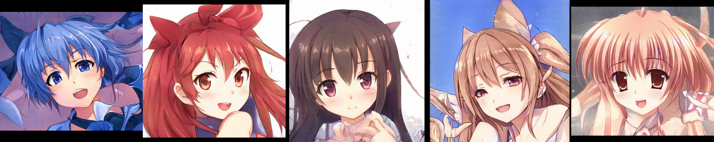
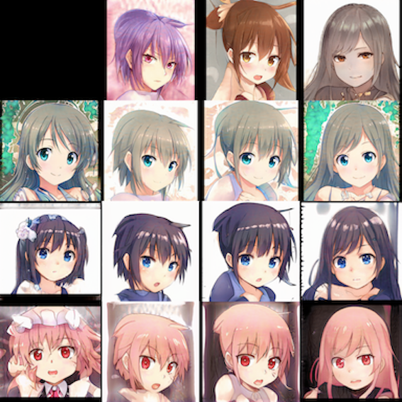
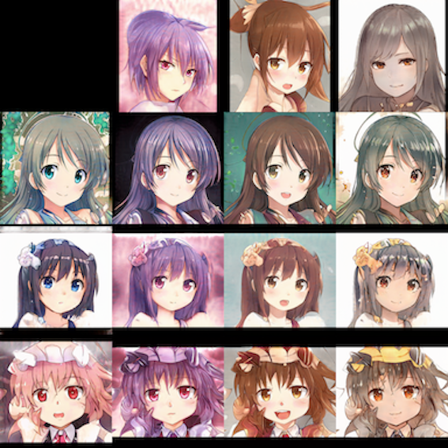
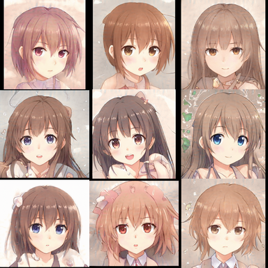
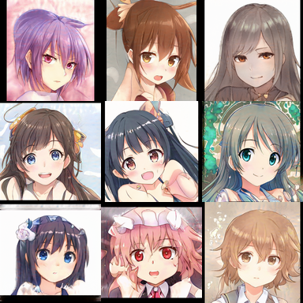
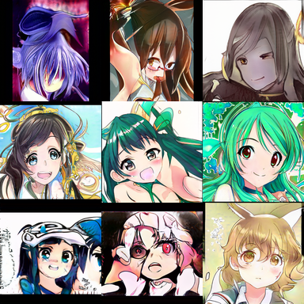
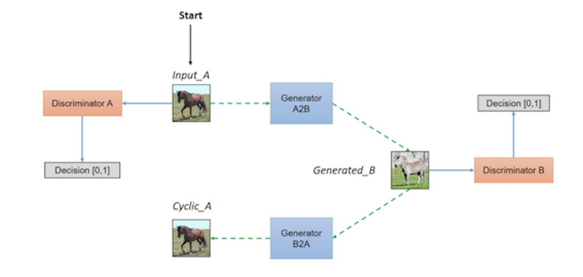
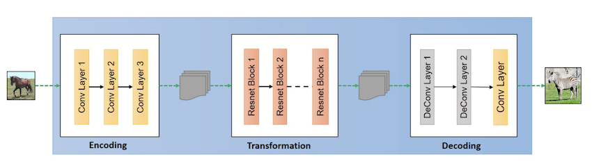
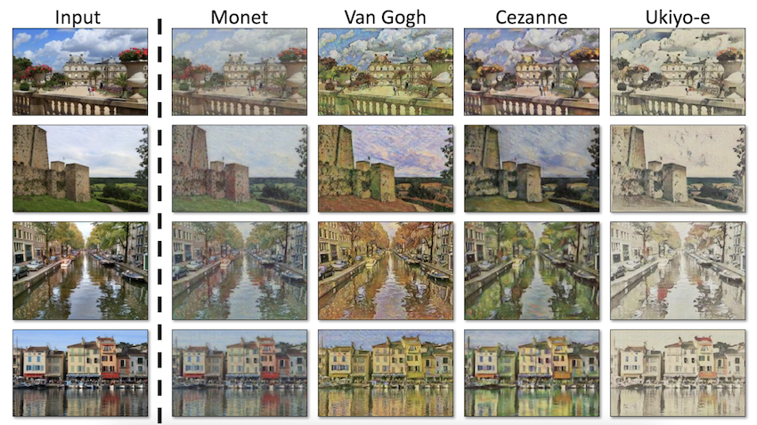

# Computer Science Communication

- Student Name: Shanchun Yi
- Student #: 1005116508

## Sharing

Please indicate whether you are comfortable sharing your submissions. Include a short description whether you would like to tweet

- [x] Peers on Forum
- [x] Anonymously via Course Twitter: [@ProbablyLearn](https://twitter.com/ProbablyLearn)
- [x] My Personal Twitter: (which @ProbablyLearn can retweet!)
- [x] Personal Blog: (which @ProbablyLearn can retweet!)
- [ ] Other:

# Generative Adversarial Networks (GANs)
GAN is the machine learning model that has two "players" competing in a zero-sum game. The Generator tries to fool the Discriminator by generating surreal outputs, whereas the Discriminator tries to counter that and still provide a correct classification. The entire structure is much like an arm race between two predictors. While the general idea remains unchanged, it depends on the implementation to design the different parts of model in detail.
## Vanilla GAN
The vanilla GAN is consist of two multi-layer perceptrons, the Generator and the Discriminator. The Generator takes a latent code and translate it to an output $\in \mathbb{R}^n$, for example, a pixel vector that represents a $\sqrt n \times \sqrt n$ image. The generator can be expressed as followed.
$$z \rightarrow G(z)$$
where $z \in \mathbb{R}^m$ is drawn from a standard Gausssian distribution. \
The other MLP is the Discriminator, which either takes the output from the Discriminator or the real sample from the dataset. The output of the Discriminator is whether 0 or 1 which indicates what the Discriminator believe the input is fake or not. The Discriminator can be expressed as below.
$$D(v) = \{0, 1\}$$
where $v\in \{G_\theta(z), x\}$, $x$ is a real data.\
Now, we can find the optimal $G$ and $D$ by calculating the following, [1]
$$\min_G \max_D V(D, G) = \mathbb{E}_{x\in \text{data}}[log(D(x))] + \mathbb{E}_{z\sim p_z(z)}[log(1 - D(G(z)))]$$
Now that we have discussed the fundamental concepts of GAN, we can explore two state-of-art GANs and discuss their strengths and weaknesses.
## StyleGAN
Some images generated by StyleGAN2 trained by a dataset of Anime portraits. [2]

StyleGAN starts off by training images on a lower resolution and builds up to higher resolution when the training is stabilized. StyleGAN maps $z$ into an intermediate latent space $w$ which is fed into different resolution layers to control which level of detail to optimize, from $4\times 4$ that dictates coarse details, to $1024 \times 1024$ that dictates more subtle features. In addition, noises are fed into each resolution layer to make images more realistic and distinct. [3] \
As a result, we can choose which layers of details to be swapped or altered. Below we will perform the famous style matching performed in the paper. [3] \
Coarse details style matched (Face shape, hair colour etc.)

Subtle details style matched (Hair colour, background colour, eye colour etc.)

Another feature of StyleGAN is that it uses a technique called truncation. StyleGAN avoids generating outputs from untrained area by shrinking the distance between the latent variable to the mean. Although this measure could potentially make images more similar to each other. Now, we can explore how truncation affects the generated portraits. \
`truncation = 0.3`, images look really alike 

`truncation = 0.7`, default setting 

`truncation = 1.5`, we see that images are getting more bizarre and even kind of scary 

## CycleGAN
Unlike StyleGAN, the main purpose of CycleGAN is image translation. CycleGAN is designed to translate images from domain $X$ to domain $Y$. For example, convert a photograph to paintings in different art style. However, the paired dataset rarely exists or sometimes too hard to collect. CycleGAN, however, can train on unpaired datasets. The general idea of CycleGAN is to connect a Generator $G$ with an inverse mapping $F$ so that $F(G(x))=x$ with the purpose of further constraint $G$. [4] \
A diagram that illustrates the rough structure is shown below [5] 

Almost all modern machine learning models that are somewhat related to images will use convolutional neural network. CycleGAN is not an exception. We can take a peek at its generator. [5]

Photographs -> Painting  

Although CycleGAN works miraculously, it still fails at some cases. Below is an translation where the model colours the rider with zebra strides. The cause of this is that the training dataset does not contain any mounted horses.

## References
[1] Goodfellow, I., Pouget-Abadie, J., Mirza, M., Xu, B., Warde-Farley, D., Ozair, S., Courville, A. and Bengio, Y., 2021. Generative Adversarial Networks. [online] arXiv.org. Available at: <https://arxiv.org/abs/1406.2661> [Accessed 11 April 2021]. \
[2] Branwen, G., 2021. Making Anime Faces With StyleGAN. [online] Gwern.net. Available at: <https://www.gwern.net/Faces> [Accessed 11 April 2021]. \
[3] Karras, T., Laine, S. and Aila, T., 2021. A Style-Based Generator Architecture for Generative Adversarial Networks. [online] arXiv.org. Available at: <https://arxiv.org/abs/1812.04948> [Accessed 11 April 2021]. \
[4] Zhu, J., Park, T., Isola, P. and Efros, A., 2021. Unpaired Image-to-Image Translation using Cycle-Consistent Adversarial Networks. [online] arXiv.org. Available at: <https://arxiv.org/abs/1703.10593> [Accessed 11 April 2021]. \
[5] Hardikbansal.github.io. 2021. CycleGAN. [online] Available at: <https://hardikbansal.github.io/CycleGANBlog/> [Accessed 11 April 2021].